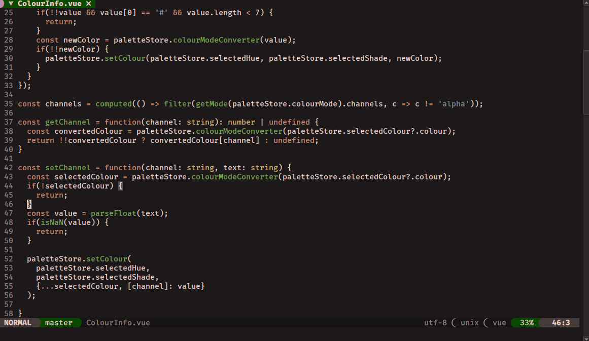

# Earthscape

A warm and earthy color theme for NeoVim.

Saturated greens and earth tones. Desaturated blues and purples.

Based on the [Themery](https://github.com/tahayvr/themery.nvim) template. Designed in [Themidor](https://themidor.cc).
